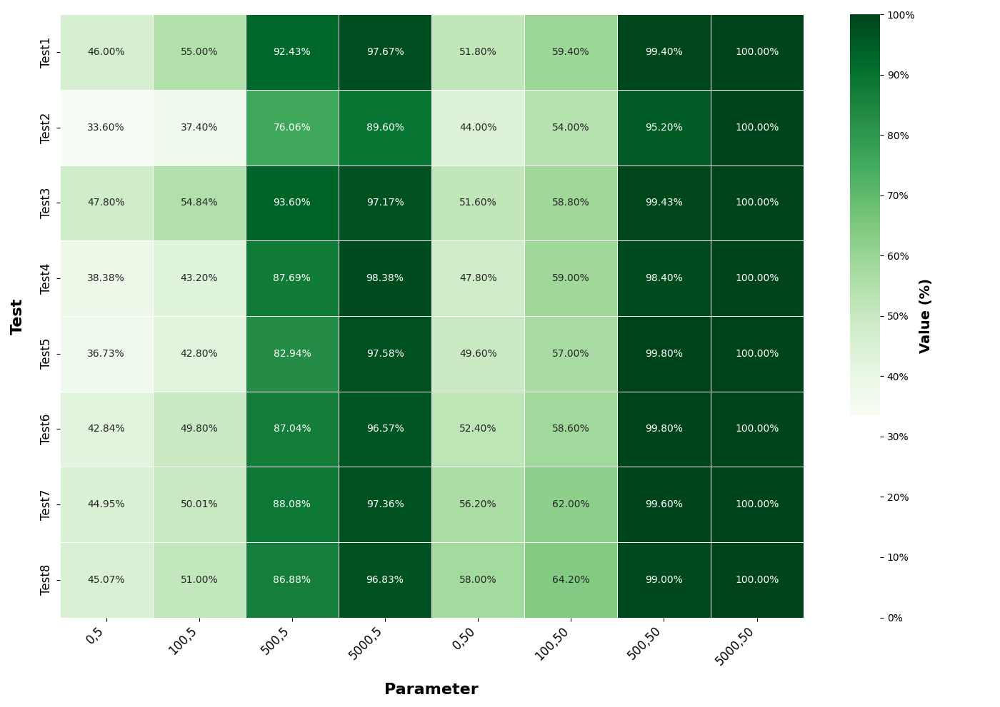

# MyStorage-Master Project

This is the root directory for the MyStorage project, which includes:
- The main static web app (`MyStorage/`)
- The GUI and automation tools for file management and GitHub integration (`FileUploader/`)

## Directory Structure
```
MyStorage-Master/
├── FileUploader/         # GUI, zipping, and GitHub integration tools
│   ├── high_performance_gui_zipper.py
│   ├── credentials.json  # (Confidential, not for public repos)
│   └── ...
├── MyStorage/            # Static web files and assets
│   ├── index.html
│   ├── script.js
│   └── ...
├── github_push.py        # CLI GitHub integration
├── git_helper.sh         # Shell helper for GitHub operations
├── secure_setup.py       # Secure token setup script
└── README.md             # This file
```
## Demo

Below are example screenshots of the application in action:

<p align="center">
  
  <br>
  <em>Figure 1: Example HeatMap PNG</em>
</p>

<p align="center">
  
  <br>
  <em>Figure 2: Example Genetic Algorithms PNG</em>
</p>

## Getting Started
1. Clone the repository:
   ```bash
   git clone https://github.com/yourusername/MyStorage-Master.git
   ```  
2. Navigate to the project directory:
   ```bash
   cd MyStorage-Master
   ```
3. Install required Python packages
4. For the GUI and automation tools
5. launch the high-performance GUI zipper:
   ```bash
   python FileUploader/high_performance_gui_zipper.py
   ```
6. For CLI GitHub integration, run:
   ```bash
   python github_push.py
   ```  

## Security Notes
- Never commit your `credentials.json` to a public repository.
- Use environment variables or the secure setup script for tokens.
- For GitHub Actions, use the built-in `GITHUB_TOKEN`.

## License
See the root project or contact the author for license details.
